<div align="center">


**Unified Agent & MCP Server Registry – Enterprise-Ready Gateway for AI Development Tools**

[](https://github.com/agentic-community/mcp-gateway-registry/stargazers)
[](https://github.com/agentic-community/mcp-gateway-registry/network)
[](https://github.com/agentic-community/mcp-gateway-registry/issues)
[](https://github.com/agentic-community/mcp-gateway-registry/blob/main/LICENSE)
[](https://github.com/agentic-community/mcp-gateway-registry/releases)

[🚀 Get Running Now](#option-a-pre-built-images-instant-setup) | [Production Deployment](terraform/aws-ecs/README.md) | [Quick Start](#quick-start) | [Documentation](docs/) | [Enterprise Features](#enterprise-features) | [Community](#community)

**Demo Videos:** ⭐ [MCP Registry CLI Demo](https://github.com/user-attachments/assets/98200866-e8bd-4ac3-bad6-c6d42b261dbe) | [Full End-to-End Functionality](https://github.com/user-attachments/assets/5ffd8e81-8885-4412-a4d4-3339bbdba4fb) | [OAuth 3-Legged Authentication](https://github.com/user-attachments/assets/3c3a570b-29e6-4dd3-b213-4175884396cc) | [Dynamic Tool Discovery](https://github.com/user-attachments/assets/cee25b31-61e4-4089-918c-c3757f84518c)

</div>

---

## What is MCP Gateway & Registry?

The **MCP Gateway & Registry** is a unified, enterprise-ready platform that centralizes access to both MCP Servers and AI Agents using the [Model Context Protocol (MCP)](https://modelcontextprotocol.io/introduction). It serves three core functions:

1. **Unified MCP Server Gateway** – Centralized access point for multiple MCP servers
2. **MCP Servers Registry** – Register, discover, and manage access to MCP servers with unified governance
3. **Agent Registry & A2A Communication Hub** – Agent registration, discovery, governance, and direct agent-to-agent communication through the [A2A (Agent-to-Agent) Protocol](https://a2a-protocol.org/latest/specification/)

The platform integrates with external registries such as Anthropic's MCP Registry (and more to come), providing a single control plane for both tool access, agent orchestration, and agent-to-agent communication patterns.

**Why unified?** Instead of managing hundreds of individual MCP server configurations, agent connections, and separate governance systems across your development teams, this platform provides secure, governed access to curated MCP servers and registered agents through a single, unified control plane.

**Transform this chaos:**
```
❌ AI agents require separate connections to each MCP server
❌ Each developer configures VS Code, Cursor, Claude Code individually
❌ Developers must install and manage MCP servers locally
❌ No standard authentication flow for enterprise tools
❌ Scattered API keys and credentials across tools
❌ No visibility into what tools teams are using
❌ Security risks from unmanaged tool sprawl
❌ No dynamic tool discovery for autonomous agents
❌ No curated tool catalog for multi-tenant environments
❌ A2A provides agent cards but no way for agents to discover other agents
❌ Maintaining separate MCP server and agent registries is a non-starter for governance
❌ Impossible to maintain unified policies across server and agent access
```

**Into this organized approach:**
```
✅ AI agents connect to one gateway, access multiple MCP servers
✅ Single configuration point for VS Code, Cursor, Claude Code
✅ Central IT manages cloud-hosted MCP infrastructure via streamable HTTP
✅ Developers use standard OAuth 2LO/3LO flows for enterprise MCP servers
✅ Centralized credential management with secure vault integration
✅ Complete visibility and audit trail for all tool usage
✅ Enterprise-grade security with governed tool access
✅ Dynamic tool discovery and invocation for autonomous workflows
✅ Registry provides discoverable, curated MCP servers for multi-tenant use
✅ Agents can discover and communicate with other agents through unified Agent Registry
✅ Single control plane for both MCP servers and agent governance
✅ Unified policies and audit trails for both server and agent access
```

```
┌─────────────────────────────────────┐     ┌──────────────────────────────────────────────────────┐
│          BEFORE: Chaos              │     │    AFTER: MCP Gateway & Registry                     │
├─────────────────────────────────────┤     ├──────────────────────────────────────────────────────┤
│                                     │     │                                                      │
│  Developer 1 ──┬──► MCP Server A    │     │  Developer 1 ──┐                  ┌─ MCP Server A    │
│                ├──► MCP Server B    │     │                │                  ├─ MCP Server B    │
│                └──► MCP Server C    │     │  Developer 2 ──┼──► MCP Gateway   │                  │
│                                     │     │                │    & Registry ───┼─ MCP Server C    │
│  Developer 2 ──┬──► MCP Server A    │ ──► │  AI Agent 1 ───┘         │        │                  │
│                ├──► MCP Server D    │     │                          │        ├─ AI Agent 1      │
│                └──► MCP Server E    │     │  AI Agent 2 ──────────────┤        ├─ AI Agent 2     │
│                                     │     │                          │        │                  │
│  AI Agent 1 ───┬──► MCP Server B    │     │  AI Agent 3 ──────────────┘        └─ AI Agent 3     │
│                ├──► MCP Server C    │     │                                                      │
│                └──► MCP Server F    │     │              Single Connection Point                 │
│                                     │     │                                                      │
│  ❌ Multiple connections per user  │     │         ✅ One gateway for all                      │
│  ❌ No centralized control         │     │         ✅ Unified server & agent access            │
│  ❌ Credential sprawl              │     │         ✅ Unified governance & audit trails        │
└─────────────────────────────────────┘     └──────────────────────────────────────────────────────┘
```

> **Note on Agent-to-Agent Communication:** AI Agents discover other AI Agents through the unified Agent Registry and communicate with them **directly** (peer-to-peer) without routing through the MCP Gateway. The Registry handles discovery, authentication, and access control, while agents maintain direct connections for efficient, low-latency communication.

## Unified Agent & Server Registry

This platform serves as a comprehensive, unified registry supporting:

- ✅ **MCP Server Registration & Discovery** – Register, discover, and manage access to MCP servers
- ✅ **AI Agent Registration & Discovery** – Register agents and enable them to discover other agents
- ✅ **Agent-to-Agent (A2A) Communication** – Direct agent-to-agent communication patterns using the A2A protocol
- ✅ **Multi-Protocol Support** – Support for various agent communication protocols and patterns
- ✅ **Unified Governance** – Single policy and access control system for both agents and servers
- ✅ **Cross-Protocol Agent Discovery** – Agents can discover each other regardless of implementation
- ✅ **Integrated External Registries** – Connect with Anthropic's MCP Registry and other external sources
- ✅ **Agent Cards & Metadata** – Rich metadata for agent capabilities, skills, and authentication schemes

Key distinction: **Unlike separate point solutions, this unified registry eliminates the need to maintain separate MCP server and agent systems**, providing a single control plane for agent orchestration, MCP server access, and agent-to-agent communication.

## MCP Servers & Agents Registry

Watch how MCP Servers, A2A Agents, and External Registries work together for dynamic tool discovery:

https://github.com/user-attachments/assets/f539f784-17f5-4658-99b3-d664bd5cecaa

---

## MCP Tools in Action

[View MCP Tools Demo](docs/img/MCP_tools.gif)

---

## MCP Registry CLI

Interactive terminal interface for chatting with AI models and discovering MCP tools in natural language. Talk to the registry using a Claude Code-like conversational interface with real-time token status, cost tracking, and AI model selection.

<div align="center">

</div>

**Quick Start:** `registry --url https://mcpgateway.ddns.net` | [Full Guide](docs/mcp-registry-cli.md)

---

## What's New

- **🏷️ Custom Metadata for Servers & Agents** - Add rich custom metadata to MCP servers and agents for organization, compliance, and integration tracking. Metadata is fully searchable via semantic search, enabling queries like "team:data-platform", "PCI-DSS compliant", or "owner:alice@example.com". Use cases include team ownership, compliance tracking (PCI-DSS, HIPAA), cost center allocation, deployment regions, JIRA tickets, and custom tags. Backward compatible with existing registrations. [Metadata Usage Guide](#custom-metadata-for-servers--agents)
- **🔎 Enhanced Hybrid Search** - Improved semantic search combining vector similarity with tokenized keyword matching for servers, tools, and agents. Explicit name references now boost relevance scores, ensuring exact matches appear first. [Hybrid Search Architecture](docs/design/hybrid-search-architecture.md)
- **🛡️ Security Scan Results in UI** - Security scan results are now displayed directly on Server and Agent cards with color-coded shield icons (gray/green/red). Click the shield icon to view detailed scan results and trigger rescans from the UI. [Security Scanner Documentation](docs/security-scanner.md)
- **🧪 Comprehensive Test Suite & Updated LLM Documentation** - Full pytest test suite with 701+ passing tests (unit, integration, E2E) running automatically on all PRs via GitHub Actions. 35% minimum coverage (targeting 80%), ~30 second execution with 8 parallel workers. Updated llms.txt provides comprehensive documentation for LLM coding assistants covering storage backend migration (file → DocumentDB/MongoDB), repository patterns, AWS ECS deployment, Microsoft Entra ID integration, dual security scanning, federation architecture, rating system, testing standards, and critical code organization antipatterns. [Testing Guide](docs/testing/README.md) | [docs/llms.txt](docs/llms.txt)
- **📊 DocumentDB & MongoDB CE Storage Backend** - Production-grade distributed storage with MongoDB-compatible backends. DocumentDB provides native HNSW vector search for sub-100ms semantic queries in production deployments, while MongoDB Community Edition 8.2 enables full-featured local development with replica sets. Both backends use the same repository abstraction layer with automatic collection management, optimized indexes, and application-level vector search for MongoDB CE. Switch between MongoDB CE (local testing) and DocumentDB (production) with a single environment variable. Note: File-based storage is deprecated and will be removed in a future release. MongoDB CE is recommended for local development. [Configuration Guide](docs/configuration.md#storage-backend-configuration) | [Storage Architecture](docs/design/storage-architecture-mongodb-documentdb.md)
- **🔒 A2A Agent Security Scanning** - Integrated security scanning for A2A agents using [Cisco AI Defense A2A Scanner](https://github.com/cisco-ai-defense/a2a-scanner). Automatic security scans during agent registration with YARA pattern matching, A2A specification validation, and heuristic threat detection. Features include automatic tagging of unsafe agents, configurable blocking policies, and detailed scan reports with API endpoints for viewing results and triggering rescans.
- **🔧 Registry Management API** - New programmatic API for managing servers, groups, and users. Python client (`api/registry_client.py`) with type-safe interfaces, RESTful HTTP endpoints (`/api/management/*`), and comprehensive error handling. Replaces shell scripts with modern API approach while maintaining backward compatibility. [API Documentation](api/README.md) | [Service Management Guide](docs/service-management.md)
- **⭐ Server & Agent Rating System** - Rate and review agents with an interactive 5-star rating widget. Users can submit ratings via the UI or CLI, view aggregate ratings with individual rating details, and update their existing ratings. Features include a rotating buffer (max 100 ratings per agent), one rating per user, float average calculations, and full OpenAPI documentation. Enables community-driven agent quality assessment and discovery.
- **🧠 Flexible Embeddings Support** - Choose from three embedding provider options for semantic search: local sentence-transformers, OpenAI, or any LiteLLM-supported provider including Amazon Bedrock Titan, Cohere, and 100+ other models. Switch providers with simple configuration changes. [Embeddings Guide](docs/embeddings.md)
- **☁️ AWS ECS Production Deployment** - Production-ready deployment on Amazon ECS Fargate with multi-AZ architecture, Application Load Balancer with HTTPS, auto-scaling, CloudWatch monitoring, and NAT Gateway high availability. Complete Terraform configuration for deploying the entire stack. [ECS Deployment Guide](terraform/aws-ecs/README.md)
- **Federated Registry** - MCP Gateway registry now supports federation of servers and agents from other registries. [Federation Guide](docs/federation.md)
- **🔗 Agent-to-Agent (A2A) Protocol Support** - Agents can now register, discover, and communicate with other agents through a secure, centralized registry. Enable autonomous agent ecosystems with Keycloak-based access control and fine-grained permissions. [A2A Guide](docs/a2a.md)
- **🏢 Microsoft Entra ID Integration** - Enterprise SSO with Microsoft Entra ID (Azure AD) authentication. Group-based access control, conditional access policies, and seamless integration with existing Microsoft 365 environments. [Entra ID Setup Guide](docs/entra-id-setup.md)
- **🤖 Agentic CLI for MCP Registry** - Talk to the Registry in natural language using a Claude Code-like interface. Discover tools, ask questions, and execute MCP commands conversationally. [Learn more](docs/mcp-registry-cli.md)
- **🔒 MCP Server Security Scanning** - Integrated vulnerability scanning with [Cisco AI Defense MCP Scanner](https://github.com/cisco-ai-defense/mcp-scanner). Automatic security scans during server registration, periodic registry-wide scans with detailed markdown reports, and automatic disabling of servers with security issues.
- **📥 Import Servers from Anthropic MCP Registry** - Import curated MCP servers from Anthropic's registry with a single command. [Import Guide](docs/anthropic-registry-import.md)
- **🔌 Anthropic MCP Registry REST API Compatibility** - Full compatibility with Anthropic's MCP Registry REST API specification. [API Documentation](docs/anthropic_registry_api.md)
- **🔎 Unified Semantic Search for Servers, Tools & Agents** - Natural-language search across every MCP server, its tools, and registered A2A agents using `POST /api/search/semantic`. Works from the dashboard UI (session cookie auth) or programmatically with JWT Bearer tokens, returning relevance-scored matches per entity type in a single response.
- **🚀 Pre-built Images** - Deploy instantly with pre-built Docker images. [Get Started](#option-a-pre-built-images-instant-setup) | [macOS Guide](docs/macos-setup-guide.md)
- **🔐 Keycloak Integration** - Enterprise authentication with AI agent audit trails and group-based authorization. [Learn more](docs/keycloak-integration.md)
- **📊 Real-Time Metrics & Observability** - Grafana dashboards with SQLite and OpenTelemetry integration. [Observability Guide](docs/OBSERVABILITY.md)
- **Amazon Bedrock AgentCore Integration** - AgentCore Gateway support with dual authentication. [Integration Guide](docs/agentcore.md)


---

## A2A Agents - Example Implementations

The registry includes two example A2A agents that demonstrate how both human developers and autonomous AI agents can discover, register, and use agents through the unified Agent Registry. Agents can programmatically discover other agents via semantic search and use them through the A2A protocol, enabling dynamic agent composition and autonomous agent orchestration.

### Example Agents

| Agent | Path | Skills |
|-------|------|--------|
| **Travel Assistant Agent** | `/travel-assistant-agent` | Flight search, pricing checks, recommendations, trip planning |
| **Flight Booking Agent** | `/flight-booking-agent` | Availability checks, flight reservations, payments, reservation management |

### Agent Discovery

**View in Registry UI:**
Open the registry and navigate to the **A2A Agents** tab to browse registered agents with their full metadata, capabilities, and skills.

**Search via CLI:**
Developers can search for agents by natural language description:

```bash
# Search for agents that can help book a trip
cli/agent_mgmt.sh search "need an agent to book a trip"
```

**Example Output:**
```
Found 4 agent(s) matching 'need an agent to book a trip':
--------------------------------------------------------------------------------------------------------------
Agent Name                               | Path                      | Score
--------------------------------------------------------------------------------------------------------------
Travel Assistant Agent                   | /travel-assistant-agent   |  0.8610
Flight Booking Agent                     | /flight-booking-agent     |  1.2134
--------------------------------------------------------------------------------------------------------------
```

### Agent-to-Agent Discovery API

The registry provides a **semantic search API** that agents can use as a tool to discover other A2A agents at runtime. This API enables dynamic agent composition where agents find collaborators based on capabilities rather than hardcoded references.

**Discovery API Endpoint:**
```
POST /api/agents/discover/semantic?query=<natural-language-query>&max_results=5
Authorization: Bearer <jwt-token>
```

**Response includes:**
- Agent name, description, and endpoint URL
- Agent card metadata with skills and capabilities
- Relevance score for ranking matches
- Trust level and visibility settings

**How agents use it:**
1. An agent calls the registry's semantic search API with a natural language query (e.g., "agent that can book flights")
2. The registry returns matching agents with their endpoint URLs and full agent card metadata
3. The agent uses the agent card to understand capabilities and invokes the discovered agent via A2A protocol

**Example - Travel Assistant discovering and invoking Flight Booking Agent:**
```
User: "I need to book a flight from NYC to LA"

Travel Assistant:
  1. Calls registry API: POST /api/agents/discover/semantic?query="book flights"
  2. Registry returns Flight Booking Agent with endpoint URL and agent card
  3. Uses agent card to understand capabilities, then sends A2A message to Flight Booking Agent
  4. Returns booking confirmation to user
```

This pattern enables agents to dynamically extend their capabilities by discovering specialized agents for tasks they cannot handle directly.

**Agent Cards:** View the agent card metadata at [agents/a2a/test/](agents/a2a/test/) to see the complete agent definitions including skills, protocols, and capabilities.

For complete agent deployment and testing documentation, see [agents/a2a/README.md](agents/a2a/README.md).

---

## Core Use Cases

### AI Agent & Coding Assistant Governance
Provide both autonomous AI agents and human developers with secure access to approved tools through AI coding assistants (VS Code, Cursor, Claude Code) while maintaining IT oversight and compliance.

### Enterprise Security & Compliance  
Centralized authentication, fine-grained permissions, and comprehensive audit trails for SOX/GDPR compliance pathways across both human and AI agent access patterns.

### Dynamic Tool Discovery
AI agents can autonomously discover and execute specialized tools beyond their initial capabilities using intelligent semantic search, while developers get guided tool discovery through their coding assistants.

### Unified Access Gateway
Single gateway supporting both autonomous AI agents (machine-to-machine) and AI coding assistants (human-guided) with consistent authentication and tool access patterns.

---

## Architecture

The MCP Gateway & Registry provides a unified platform for both autonomous AI agents and AI coding assistants to access enterprise-curated tools through a centralized gateway with comprehensive authentication and governance.

```mermaid
flowchart TB
    subgraph Human_Users["Human Users"]
        User1["Human User 1"]
        User2["Human User 2"]
        UserN["Human User N"]
    end

    subgraph AI_Agents["AI Agents"]
        Agent1["AI Agent 1"]
        Agent2["AI Agent 2"]
        Agent3["AI Agent 3"]
        AgentN["AI Agent N"]
    end

    subgraph EC2_Gateway["<b>MCP Gateway & Registry</b> (Amazon EC2 Instance)"]
        subgraph NGINX["NGINX Reverse Proxy"]
            RP["Reverse Proxy Router"]
        end
        
        subgraph AuthRegistry["Authentication & Registry Services"]
            AuthServer["Auth Server<br/>(Dual Auth)"]
            Registry["Registry<br/>Web UI"]
            RegistryMCP["Registry<br/>MCP Server"]
        end
        
        subgraph LocalMCPServers["Local MCP Servers"]
            MCP_Local1["MCP Server 1"]
            MCP_Local2["MCP Server 2"]
        end
    end
    
    %% Identity Provider
    IdP[Identity Provider<br/>Keycloak/Cognito]
    
    subgraph EKS_Cluster["Amazon EKS/EC2 Cluster"]
        MCP_EKS1["MCP Server 3"]
        MCP_EKS2["MCP Server 4"]
    end
    
    subgraph APIGW_Lambda["Amazon API Gateway + AWS Lambda"]
        API_GW["Amazon API Gateway"]
        Lambda1["AWS Lambda Function 1"]
        Lambda2["AWS Lambda Function 2"]
    end
    
    subgraph External_Systems["External Data Sources & APIs"]
        DB1[(Database 1)]
        DB2[(Database 2)]
        API1["External API 1"]
        API2["External API 2"]
        API3["External API 3"]
    end
    
    %% Connections from Human Users
    User1 -->|Web Browser<br>Authentication| IdP
    User2 -->|Web Browser<br>Authentication| IdP
    UserN -->|Web Browser<br>Authentication| IdP
    User1 -->|Web Browser<br>HTTPS| Registry
    User2 -->|Web Browser<br>HTTPS| Registry
    UserN -->|Web Browser<br>HTTPS| Registry
    
    %% Connections from Agents to Gateway
    Agent1 -->|MCP Protocol<br>SSE with Auth| RP
    Agent2 -->|MCP Protocol<br>SSE with Auth| RP
    Agent3 -->|MCP Protocol<br>Streamable HTTP with Auth| RP
    AgentN -->|MCP Protocol<br>Streamable HTTP with Auth| RP
    
    %% Auth flow connections
    RP -->|Auth validation| AuthServer
    AuthServer -.->|Validate credentials| IdP
    Registry -.->|User authentication| IdP
    RP -->|Tool discovery| RegistryMCP
    RP -->|Web UI access| Registry
    
    %% Connections from Gateway to MCP Servers
    RP -->|SSE| MCP_Local1
    RP -->|SSE| MCP_Local2
    RP -->|SSE| MCP_EKS1
    RP -->|SSE| MCP_EKS2
    RP -->|Streamable HTTP| API_GW
    
    %% Connections within API GW + Lambda
    API_GW --> Lambda1
    API_GW --> Lambda2
    
    %% Connections to External Systems
    MCP_Local1 -->|Tool Connection| DB1
    MCP_Local2 -->|Tool Connection| DB2
    MCP_EKS1 -->|Tool Connection| API1
    MCP_EKS2 -->|Tool Connection| API2
    Lambda1 -->|Tool Connection| API3

    %% Style definitions
    classDef user fill:#fff9c4,stroke:#f57f17,stroke-width:2px
    classDef agent fill:#e1f5fe,stroke:#29b6f6,stroke-width:2px
    classDef gateway fill:#e8f5e9,stroke:#66bb6a,stroke-width:2px
    classDef nginx fill:#f3e5f5,stroke:#ab47bc,stroke-width:2px
    classDef mcpServer fill:#fff3e0,stroke:#ffa726,stroke-width:2px
    classDef eks fill:#ede7f6,stroke:#7e57c2,stroke-width:2px
    classDef apiGw fill:#fce4ec,stroke:#ec407a,stroke-width:2px
    classDef lambda fill:#ffebee,stroke:#ef5350,stroke-width:2px
    classDef dataSource fill:#e3f2fd,stroke:#2196f3,stroke-width:2px
    
    %% Apply styles
    class User1,User2,UserN user
    class Agent1,Agent2,Agent3,AgentN agent
    class EC2_Gateway,NGINX gateway
    class RP nginx
    class AuthServer,Registry,RegistryMCP gateway
    class IdP apiGw
    class MCP_Local1,MCP_Local2 mcpServer
    class EKS_Cluster,MCP_EKS1,MCP_EKS2 eks
    class API_GW apiGw
    class Lambda1,Lambda2 lambda
    class DB1,DB2,API1,API2,API3 dataSource
```



**Key Architectural Benefits:**
- **Unified Gateway**: Single point of access for both AI agents and human developers through coding assistants
- **Dual Authentication**: Supports both human user authentication and machine-to-machine agent authentication
- **Scalable Infrastructure**: Nginx reverse proxy with horizontal scaling capabilities
- **Multiple Transports**: SSE and Streamable HTTP support for different client requirements

---

## Key Advantages

### **Enterprise-Grade Security**
- OAuth 2.0/3.0 compliance with IdP integration
- Fine-grained access control at tool and method level  
- Zero-trust network architecture
- Complete audit trails and comprehensive analytics for compliance

### **AI Agent & Developer Experience**
- Single configuration works across autonomous AI agents and AI coding assistants (VS Code, Cursor, Claude Code, Cline)
- Dynamic tool discovery with natural language queries for both agents and humans
- Instant onboarding for new team members and AI agent deployments
- Unified governance for both AI agents and human developers

### **Production Ready**
- Container-native (Docker/Kubernetes)
- Real-time health monitoring and alerting
- Dual authentication supporting both human and machine authentication

---
## Quick Start

There are 3 options for setting up the MCP Gateway & Registry:

- **Option A: Pre-built Images** — Fastest setup using pre-built Docker or Podman containers. Recommended for most users.
- **Option B: Podman (Rootless)** — Detailed Podman-specific instructions for macOS and rootless Linux environments.
- **Option C: Build from Source** — Full source build for customization or development.

### Option A: Pre-built Images (Instant Setup)

Get running in under 2 minutes with pre-built containers:

**Step 1: Clone and setup**
```bash
git clone https://github.com/agentic-community/mcp-gateway-registry.git
cd mcp-gateway-registry
cp .env.example .env
```

**Step 2: Download embeddings model**
Download the required sentence-transformers model to the shared models directory:
```bash
hf download sentence-transformers/all-MiniLM-L6-v2 --local-dir ${HOME}/mcp-gateway/models/all-MiniLM-L6-v2
```

**Step 3: Configure environment**
Complete: **[Initial Environment Configuration](docs/complete-setup-guide.md#initial-environment-configuration)** - Configure domains, passwords, and authentication
```bash
export DOCKERHUB_ORG=mcpgateway
```

**Step 4: Deploy with pre-built images**
Our service can be deployed with two platforms for pre-built images: Docker and Podman. 

**With Docker (default):**
```bash
./build_and_run.sh --prebuilt
```

**With Podman (rootless, macOS (but NOT Apple Silicon) friendly):**
```bash
./build_and_run.sh --prebuilt --podman

# If running on macOS Apple Silicon, remove the --prebuilt flag (more details in Podman option below) 
./build_and_run.sh --podman # For Apple Silicon 
```

> **Port Differences:**
> - **Docker**: Services run on privileged ports (`http://localhost`, `https://localhost`)
> - **Podman**: Services run on non-privileged ports (`http://localhost:8080`, `https://localhost:8443`)
> - All internal service ports remain the same (Registry: 7860, Auth: 8888, etc.)

For detailed information about all Docker images used with `--prebuilt`, see [Pre-built Images Documentation](docs/prebuilt-images.md).

**Step 5: Initialize Keycloak**
Complete: **[Initialize Keycloak Configuration](docs/complete-setup-guide.md#initialize-keycloak-configuration)** - Set up identity provider and security policies

**Step 5.5: Set up users and service accounts**
Run the bootstrap script to create default users and M2M service accounts:
```bash
./cli/bootstrap_user_and_m2m_setup.sh
```

This script:
- Creates 3 Keycloak groups: `registry-users-lob1`, `registry-users-lob2`, `registry-admins`
- Creates 6 users for testing and management:
  - **LOB1**: `lob1-bot` (M2M service account) and `lob1-user` (human user)
  - **LOB2**: `lob2-bot` (M2M service account) and `lob2-user` (human user)
  - **Admin**: `admin-bot` (M2M service account) and `admin-user` (human user)
- Generates and saves OAuth credentials to `.oauth-tokens/` directory

All user passwords default to the value set in your `.env` file (`INITIAL_USER_PASSWORD`).

**Step 6: Access the registry**
```bash
open http://localhost:7860
```

**Step 7: Create your first agent**
Complete: **[Create Your First AI Agent Account](docs/complete-setup-guide.md#create-your-first-ai-agent-account)** - Create agent credentials for testing

**Step 8: Restart auth server to apply new credentials**
```bash
docker-compose down auth-server && docker-compose rm -f auth-server && docker-compose up -d auth-server
```

**Step 9: Test the setup**
Complete: **[Testing with mcp_client.py and agent.py](docs/complete-setup-guide.md#test-with-python-mcp-client)** - Validate your setup works correctly

**Benefits:** No build time • No Node.js required • No frontend compilation • Consistent tested images

### Option B: Podman (Rootless Container Deployment)

**Perfect for macOS and rootless Linux environments**

Podman provides rootless container execution without requiring privileged ports, making it ideal for:
- **macOS** users with Podman Desktop
- **Linux** users preferring rootless containers
- **Development** environments where Docker daemon isn't available

**Quick Podman Setup (macOS non-Apple Silicon):**

```bash
# Install Podman Desktop
brew install podman-desktop
# OR download from: https://podman-desktop.io/
```

Inside Podman Desktop, go to Preferences > Podman Machine and create a new machine with at least 4 CPUs and 8GB RAM. Alternatively, see more detailed [Podman installation guide] (docs/installation.md#podman-installation) for instructions on setting this up on CLI. 

```bash
# Initialize Podman machine
podman machine init
podman machine start

# Verify installation
podman --version
podman compose version

# Configure environment
cp .env.example .env
# Edit .env with your credentials
```

**Deploy with Podman** see full Podman setup instructions (downloading, installing, and initializing a first Podman container, as well as troubleshooting) in our [Installation Guide](docs/installation.md#podman-installation).

**Build with Podman:**

```bash
# Auto-detect (will use Podman if Docker not available)
./build_and_run.sh --prebuilt

# Explicit Podman mode (only non-Apple Silicon)
./build_and_run.sh --prebuilt --podman

# Access registry at non-privileged ports
open http://localhost:8080
```

> Note: **Apple Silicon (M1/M2/M3)?** Don't use `--prebuilt` with Podman on ARM64. This will cause a "proxy already running" error. See [Podman on Apple Silicon Guide](docs/podman-apple-silicon.md). 

```bash
# To run on Apple Silicon Macs:
./build_and_run.sh --podman
```

**Key Differences vs. Docker:**
- No root/sudo required
- Works on macOS without privileged port access
- HTTP port: `8080` (instead of `80`)
- HTTPS port: `8443` (instead of `443`)
- All other service ports unchanged

For detailed Podman setup instructions, see [Installation Guide](docs/installation.md#podman-installation) and [macOS Setup Guide](docs/macos-setup-guide.md#podman-deployment).

### Option C: Build from Source

**New to MCP Gateway?** Start with our [Complete Setup Guide](docs/complete-setup-guide.md) for detailed step-by-step instructions from scratch on AWS EC2.

**Running on macOS?** See our [macOS Setup Guide](docs/macos-setup-guide.md) for platform-specific instructions and optimizations.

### Testing & Integration Options

**Test Suite:**
The project includes comprehensive automated testing with pytest:

```bash
# Run all tests
make test

# Run only unit tests (fast)
make test-unit

# Run with coverage report
make test-coverage

# Run specific test categories
uv run pytest -m unit           # Unit tests only
uv run pytest -m integration    # Integration tests
uv run pytest -m "not slow"     # Skip slow tests
```

**Test Structure:**
- **Unit Tests** (`tests/unit/`) - Fast, isolated component tests
- **Integration Tests** (`tests/integration/`) - Component interaction tests
- **E2E Tests** (`tests/integration/test_e2e_workflows.py`) - Complete workflow tests

**Python Agent:**
- `agents/agent.py` - Full-featured Python agent with advanced AI capabilities

**Testing Documentation:**
- [Testing Guide](docs/testing/README.md) - Comprehensive testing documentation
- [Writing Tests](docs/testing/WRITING_TESTS.md) - How to write effective tests
- [Test Maintenance](docs/testing/MAINTENANCE.md) - Maintaining test suite health

**Pre-commit Hooks:**
```bash
# Install pre-commit hooks
pip install pre-commit
pre-commit install

# Run hooks manually
pre-commit run --all-files
```

**Next Steps:** [Complete Installation Guide](docs/installation.md) | [Authentication Setup](docs/auth.md) | [AI Assistant Integration](docs/ai-coding-assistants-setup.md)

---

## Custom Metadata for Servers & Agents

Enrich your MCP servers and agents with custom metadata for organization, compliance tracking, and integration purposes. All metadata is fully searchable via semantic search.

### Use Cases

**Organization & Team Management:**
```json
{
  "team": "data-platform",
  "owner": "alice@example.com",
  "department": "engineering"
}
```
*Search by: "team:data-platform servers", "alice@example.com owned services"*

**Compliance & Governance:**
```json
{
  "compliance_level": "PCI-DSS",
  "data_classification": "confidential",
  "regulatory_requirements": ["GDPR", "HIPAA"],
  "audit_logging": true
}
```
*Search by: "PCI-DSS compliant servers", "HIPAA regulated services"*

**Cost & Project Tracking:**
```json
{
  "cost_center": "analytics-dept",
  "project_code": "AI-2024-Q1",
  "budget_allocation": "R&D"
}
```
*Search by: "cost center analytics", "project AI-2024-Q1"*

**Deployment & Integration:**
```json
{
  "deployment_region": "us-east-1",
  "environment": "production",
  "jira_ticket": "MCPGW-123",
  "version": "2.1.0"
}
```
*Search by: "us-east-1 deployed services", "JIRA MCPGW-123", "version 2.1.0"*

### API Usage

**Register MCP Server with Metadata:**
```bash
curl -X POST https://registry.example.com/api/services/register \
  -H "Content-Type: application/json" \
  -d '{
    "name": "payment-processor",
    "description": "Payment processing service",
    "path": "/payment-processor",
    "proxy_pass_url": "http://payment:8080",
    "metadata": {
      "team": "finance-platform",
      "owner": "alice@example.com",
      "compliance_level": "PCI-DSS",
      "cost_center": "finance-ops",
      "deployment_region": "us-east-1"
    }
  }'
```

**Register A2A Agent with Metadata:**
```bash
curl -X POST https://registry.example.com/api/agents/register \
  -H "Content-Type: application/json" \
  -d '{
    "name": "analytics-agent",
    "description": "Data analytics agent",
    "metadata": {
      "team": "data-science",
      "owner": "bob@example.com",
      "version": "3.2.1",
      "cost_center": "analytics-dept"
    }
  }'
```

**Search by Metadata:**
```bash
# Find servers by team
curl "https://registry.example.com/api/search?q=team:finance-platform"

# Find PCI-DSS compliant services
curl "https://registry.example.com/api/search?q=PCI-DSS compliant services"

# Find services by owner
curl "https://registry.example.com/api/search?q=alice@example.com owned"

# Find services in specific region
curl "https://registry.example.com/api/search?q=us-east-1 deployed"
```

### Key Features

- **Flexible Schema:** Store any JSON-serializable data (strings, numbers, booleans, nested objects, arrays)
- **Fully Searchable:** All metadata included in semantic search embeddings
- **Backward Compatible:** Optional field - existing registrations work without modification
- **Type-Safe:** Pydantic validation ensures data integrity
- **REST API:** Full CRUD support via standard API endpoints

---

## Enterprise Features

### AI Agents & Coding Assistants Integration

Transform how both autonomous AI agents and development teams access enterprise tools with centralized governance:

<table>
<tr>
<td width="50%">

<p><em>Enterprise-curated MCP servers accessible through unified gateway</em></p>
</td>
<td width="50%">

<p><em>AI assistants executing approved enterprise tools with governance</em></p>
</td>
</tr>
<tr>
<td colspan="2">

### Observability

Comprehensive real-time metrics and monitoring through Grafana dashboards with dual-path storage: SQLite for detailed historical analysis and OpenTelemetry (OTEL) export for integration with Prometheus, CloudWatch, Datadog, and other monitoring platforms. Track authentication events, tool executions, discovery queries, and system performance metrics. [Learn more](docs/OBSERVABILITY.md)


<p><em>Real-time metrics and observability dashboard tracking server health, tool usage, and authentication events</em></p>
</td>
</tr>
</table>

### Anthropic MCP Registry Integration

Seamlessly integrate with Anthropic's official MCP Registry to import and access curated MCP servers through your gateway:

- **Import Servers**: Select and import desired servers from Anthropic's registry with a single command
- **Unified Access**: Access imported servers through your gateway with centralized authentication and governance
- **API Compatibility**: Full support for Anthropic's Registry REST API specification - point your Anthropic API clients to this registry to discover available servers


<p><em>Import and access curated MCP servers from Anthropic's official registry</em></p>

[Import Guide](docs/anthropic-registry-import.md) | [Registry API Documentation](docs/anthropic_registry_api.md)

### Federation - External Registry Integration

**Unified Multi-Registry Access:**
- **Anthropic MCP Registry** - Import curated MCP servers with purple `ANTHROPIC` visual tags
- **Workday ASOR** - Import AI agents from Agent System of Record with orange `ASOR` visual tags  
- **Automatic Sync** - Scheduled synchronization with external registries
- **Visual Identification** - Clear visual tags distinguish federation sources in the UI
- **Centralized Management** - Single control plane for all federated servers and agents

**Quick Setup:**
```bash
# Configure federation sources
echo 'ASOR_ACCESS_TOKEN=your_token' >> .env

# Update federation.json with your sources
# Restart services
./build_and_run.sh
```

[**📖 Complete Federation Guide**](docs/federation.md) - Environment setup, authentication, configuration, and troubleshooting

### Security Scanning

**Integrated Vulnerability Detection:**
- **Automated Security Scanning** - Integrated vulnerability scanning for MCP servers using [Cisco AI Defence MCP Scanner](https://github.com/cisco-ai-defense/mcp-scanner), with automatic scans during registration and support for periodic registry-wide scans
- **Detailed Security Reports** - Comprehensive markdown reports with vulnerability details, severity assessments, and remediation recommendations
- **Automatic Protection** - Servers with security issues are automatically disabled with security-pending status to protect your infrastructure
- **Compliance Ready** - Security audit trails and vulnerability tracking for enterprise compliance requirements

### Authentication & Authorization

**Multiple Identity Modes:**
- **Machine-to-Machine (M2M)** - For autonomous AI agents and automated systems
- **Three-Legged OAuth (3LO)** - For external service integration (Atlassian, Google, GitHub)
- **Session-Based** - For human developers using AI coding assistants and web interface

**Supported Identity Providers:** Keycloak, Amazon Cognito, and any OAuth 2.0 compatible provider. [Learn more](docs/auth.md)

**Fine-Grained Permissions:** Tool-level, method-level, team-based, and temporary access controls. [Learn more](docs/scopes.md)

### Production Deployment

**Cloud Platforms:** Amazon EC2, Amazon EKS

---

## Deployments

### AWS Elastic Container Service (ECS)

<div align="center">

</div>

**Production-ready deployment** on Amazon ECS Fargate with comprehensive enterprise features:

- **Multi-AZ Architecture** - High availability across multiple availability zones
- **Application Load Balancer** - HTTPS/SSL termination with automatic certificate management via ACM
- **Auto-scaling** - Dynamic scaling based on CPU and memory utilization
- **CloudWatch Integration** - Comprehensive monitoring, logging, and alerting
- **NAT Gateway HA** - High-availability NAT gateway configuration for secure outbound connectivity
- **Keycloak Integration** - Enterprise authentication with RDS Aurora PostgreSQL backend
- **EFS Shared Storage** - Persistent storage for models, logs, and configuration
- **Service Discovery** - AWS Cloud Map for service-to-service communication

**[Complete ECS Deployment Guide](terraform/aws-ecs/README.md)** - Step-by-step instructions for deploying the entire stack with Terraform.

### Amazon EKS (Kubernetes)

**Coming Soon** - Kubernetes deployment on Amazon EKS with Helm charts for container orchestration at scale.

---

## Documentation

| Getting Started | Enterprise Setup | Developer & Operations |
|------------------|-------------------|------------------------|
| [Complete Setup Guide](docs/complete-setup-guide.md)<br/>**NEW!** Step-by-step from scratch on AWS EC2 | [Authentication Guide](docs/auth.md)<br/>OAuth and identity provider integration | [AI Coding Assistants Setup](docs/ai-coding-assistants-setup.md)<br/>VS Code, Cursor, Claude Code integration |
| [Installation Guide](docs/installation.md)<br/>Complete setup instructions for EC2 and EKS | [AWS ECS Deployment](terraform/aws-ecs/README.md)<br/>Production-ready deployment on AWS ECS Fargate | [API Reference](docs/registry_api.md)<br/>Programmatic registry management |
| [Keycloak Integration](docs/keycloak-integration.md)<br/>Enterprise identity with agent audit trails | [Token Refresh Service](docs/token-refresh-service.md)<br/>Automated token refresh and lifecycle management | [MCP Registry CLI](docs/mcp-registry-cli.md)<br/>Command-line client for registry management |
| [Configuration Reference](docs/configuration.md)<br/>Environment variables and settings | [Amazon Cognito Setup](docs/cognito.md)<br/>Step-by-step IdP configuration | [Observability Guide](docs/OBSERVABILITY.md)<br/>**NEW!** Metrics, monitoring, and OpenTelemetry setup |
| | [Anthropic Registry Import](docs/anthropic-registry-import.md)<br/>**NEW!** Import servers from Anthropic MCP Registry | [Federation Guide](docs/federation.md)<br/>**NEW!** External registry integration (Anthropic, ASOR) |
| | [Service Management](docs/service-management.md)<br/>Server lifecycle and operations | [Anthropic Registry API](docs/anthropic_registry_api.md)<br/>**NEW!** REST API compatibility |
| | | [Fine-Grained Access Control](docs/scopes.md)<br/>Permission management and security |
| | | [Dynamic Tool Discovery](docs/dynamic-tool-discovery.md)<br/>Autonomous agent capabilities |
| | | [Production Deployment](docs/installation.md)<br/>Complete setup for production environments |
| | | [Troubleshooting Guide](docs/FAQ.md)<br/>Common issues and solutions |

---

## Community

### Get Involved

**Join the Discussion**
- [GitHub Discussions](https://github.com/agentic-community/mcp-gateway-registry/discussions) - Feature requests and general discussion
- [GitHub Issues](https://github.com/agentic-community/mcp-gateway-registry/issues) - Bug reports and feature requests

**Contributing**
- [Contributing Guide](CONTRIBUTING.md) - How to contribute code and documentation
- [Code of Conduct](CODE_OF_CONDUCT.md) - Community guidelines
- [Security Policy](SECURITY.md) - Responsible disclosure process

### Star History

[](https://star-history.com/#agentic-community/mcp-gateway-registry&Date)

### Roadmap

Our development roadmap is organized into weekly milestones with clear deliverables and progress tracking:

| Milestone | Due Date | Progress | Status | Key Issues |
|-----------|----------|----------|--------|------------|
| **December 2025 Week 4** | 2025-12-27 | 43% (3/7) | 🚧 In Progress | **Open:** [#317 - Optional PyTorch Dependencies](https://github.com/agentic-community/mcp-gateway-registry/issues/317), [#293 - CloudFront HTTPS Support](https://github.com/agentic-community/mcp-gateway-registry/issues/293), [#285 - Server Headers in Nginx](https://github.com/agentic-community/mcp-gateway-registry/issues/285), [#232 - A2A Curated Registry Discovery](https://github.com/agentic-community/mcp-gateway-registry/issues/232)<br/>**Closed:** [#287 - Filter Sidebar Buttons](https://github.com/agentic-community/mcp-gateway-registry/issues/287), [#284 - Statistics Count Fix](https://github.com/agentic-community/mcp-gateway-registry/issues/284), [#221 - DocumentDB Implementation](https://github.com/agentic-community/mcp-gateway-registry/issues/221) |
| **January 2026 Week 1** | 2026-01-09 | 50% (2/4) | 🚧 In Progress | **Open:** [#297 - Unified UI Registration Flow](https://github.com/agentic-community/mcp-gateway-registry/issues/297), [#296 - Custom Metadata for Cards](https://github.com/agentic-community/mcp-gateway-registry/issues/296)<br/>**Closed:** [#329 - Update llms.txt](https://github.com/agentic-community/mcp-gateway-registry/issues/329), [#259 - Simplify JWT Token Generation](https://github.com/agentic-community/mcp-gateway-registry/issues/259) |
| **January 2026 Week 3** | 2026-01-23 | 0% (0/2) | 📅 Planned | **Open:** [#295 - Multi-Level Rate Limiting](https://github.com/agentic-community/mcp-gateway-registry/issues/295), [#129 - Virtual MCP Server Support](https://github.com/agentic-community/mcp-gateway-registry/issues/129) |
| **January 2026 Week 4** | 2026-01-30 | 0% (0/2) | 📅 Planned | **Open:** [#269 - AgentCore IAM Authentication](https://github.com/agentic-community/mcp-gateway-registry/issues/269), [#260 - Federation Between Registries](https://github.com/agentic-community/mcp-gateway-registry/issues/260) |
| **Parking Lot** | — | 50% (1/2) | 🗂️ Backlog | **Open:** [#316 - Entra ID IAM APIs](https://github.com/agentic-community/mcp-gateway-registry/issues/316)<br/>**Closed:** [#315 - Distroless Docker Images](https://github.com/agentic-community/mcp-gateway-registry/issues/315) |

**Status Legend:** 🚧 In Progress • 📅 Planned • 🗂️ Backlog • ✅ Complete

---

#### Major Features

The following major features span multiple milestones and represent significant architectural improvements:

- **[#129 - Virtual MCP Server Support](https://github.com/agentic-community/mcp-gateway-registry/issues/129)** 🚧 **IN PROGRESS** (Jan 2026 Week 3)
  Dynamic tool aggregation and intelligent routing using Lua/JavaScript scripting. Enables logical grouping of tools from multiple backend servers.

- **[#232 - A2A Curated Registry Discovery](https://github.com/agentic-community/mcp-gateway-registry/issues/232)** 🚧 **IN PROGRESS** (Dec 2025 Week 4)
  Enable agent-to-agent discovery and tool invocation through curated registry patterns.

- **[#260 - Federation Between MCP Registry Instances](https://github.com/agentic-community/mcp-gateway-registry/issues/260)** 📅 **PLANNED** (Jan 2026 Week 4)
  Support for federated registry discovery and access across multiple registry instances.

- **[#295 - Multi-Level Tool Usage Rate Limiting](https://github.com/agentic-community/mcp-gateway-registry/issues/295)** 📅 **PLANNED** (Jan 2026 Week 3)
  Comprehensive rate limiting architecture with detailed implementation guide for tool usage control.

- **[#297 - Unified UI Registration Flow](https://github.com/agentic-community/mcp-gateway-registry/issues/297)** 🚧 **IN PROGRESS** (Jan 2026 Week 1)
  Streamlined registration experience for both MCP servers and A2A agents through a unified interface.

---

#### Recently Completed

- **[#329 - Update llms.txt](https://github.com/agentic-community/mcp-gateway-registry/issues/329)** ✅ **COMPLETED** (v1.0.9)
  Updated AI assistant reference documentation with recent architecture changes.

- **[#221 - DocumentDB Implementation](https://github.com/agentic-community/mcp-gateway-registry/issues/221)** ✅ **COMPLETED** (v1.0.9)
  Production-grade distributed storage with MongoDB/DocumentDB backend implementation.

- **[#70 - Docker Build & Runtime Performance Optimization](https://github.com/agentic-community/mcp-gateway-registry/issues/70)** ✅ **COMPLETED** (v1.0.9)
  Multi-stage Docker builds with 66-80% image size reduction.

- **[#287 - Filter Sidebar Buttons](https://github.com/agentic-community/mcp-gateway-registry/issues/287)** ✅ **COMPLETED**
  Fixed filter buttons to properly filter both MCP servers and A2A agent cards.

- **[#284 - Statistics Count Fix](https://github.com/agentic-community/mcp-gateway-registry/issues/284)** ✅ **COMPLETED**
  Sidebar statistics now correctly count both MCP servers and A2A agents.

- **[#259 - Simplify JWT Token Generation](https://github.com/agentic-community/mcp-gateway-registry/issues/259)** ✅ **COMPLETED**
  Streamlined JWT token generation process in Registry UI.

- **[#315 - Distroless Docker Images](https://github.com/agentic-community/mcp-gateway-registry/issues/315)** ✅ **COMPLETED**
  Security hardening through migration to distroless/hardened base images.

For the complete list of all issues, feature requests, and detailed release history, visit:
- [All GitHub Issues](https://github.com/agentic-community/mcp-gateway-registry/issues)
- [All GitHub Milestones](https://github.com/agentic-community/mcp-gateway-registry/milestones)
- [Release Notes](release-notes/)

---

## License

This project is licensed under the Apache-2.0 License - see the [LICENSE](LICENSE) file for details.

---

<div align="center">

**⭐ Star this repository if it helps your organization!**

[Get Started](docs/installation.md) | [Documentation](docs/) | [Contribute](CONTRIBUTING.md)

</div>